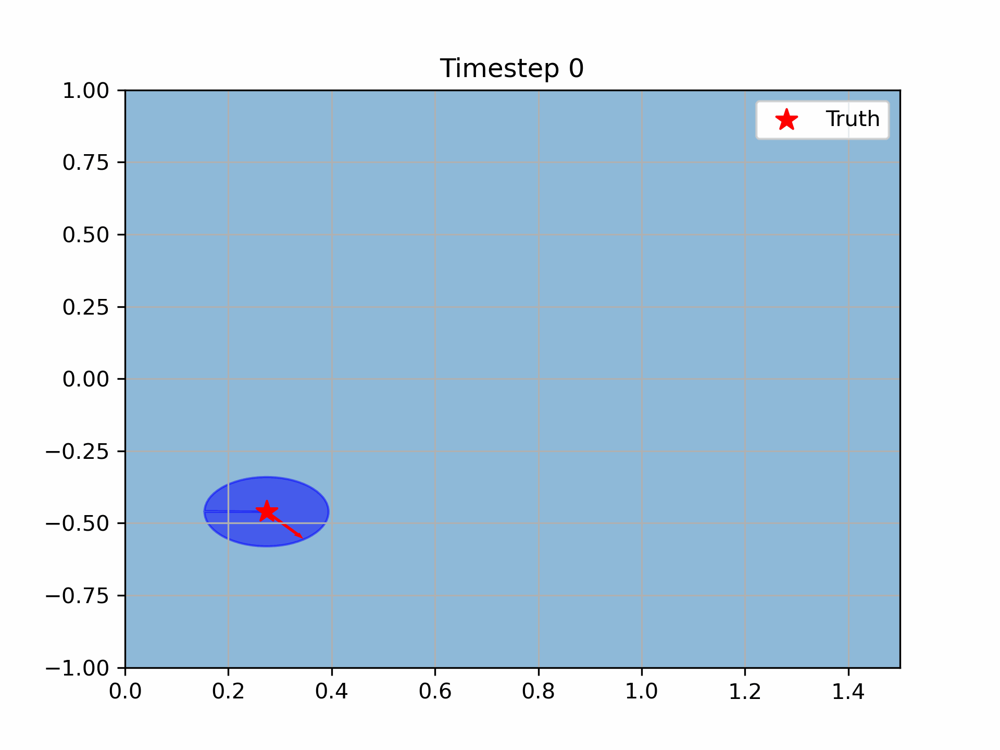

# What this repository explores
This repository implements a simple polyhedron-based set-valued observer as detailed in [this paper](https://citeseerx.ist.psu.edu/document?repid=rep1&type=pdf&doi=0dd361c4ae2b294d4693922bcb75024a427d298a).  The observer is implemented on a Dubins car or "unicycle" model, i.e., a system evolving according to the dynamics:

```math
\begin{pmatrix}\dot{x} \\ \dot{y} \\ \dot{\theta}
\end{pmatrix} = \begin{pmatrix}\cos(\theta) & 0 \\ \sin(\theta) & 0 \\ 0 & 1
\end{pmatrix}\begin{pmatrix}
u \\ v
\end{pmatrix},
```

where $(x,y,\theta) \in \mathcal{SE}(2)$ denotes the pose of the unicycle, and  $u\in\mathbb{R}$ is the angular velocity and $v\in\mathbb{R}$ is the linear velocity.

The novelty in this exploration was that the the dynamics are nonlinear, but the dynamics of the error between the true system state and a reference one (under the same control input) are linear, therefore we can use set-valued observer tools that typically only work for linear systems.  This mathematical property was established in [this paper](https://arxiv.org/pdf/1410.1465.pdf).

# What is in this repository
In the "utils" folder there are the Dubins-car and linear-time-varying system python classes for use in simulation.

Within shared utils, there are appropriate Lie logarithm and exponential maps as needed by the various simulations.  The outermost example python files run simple examples to check the set-valued observer (polytope_test_sim_1d.py and polytope_test_sim_2d.py) and the dubins car (dubins_test_sim.py). The files (dubins_polytope_observer.py and dubins_polytope_observer_th.py) use the polytope observer on the lie logarithm of the error dynamics of the Dubins car.

Visualization:


